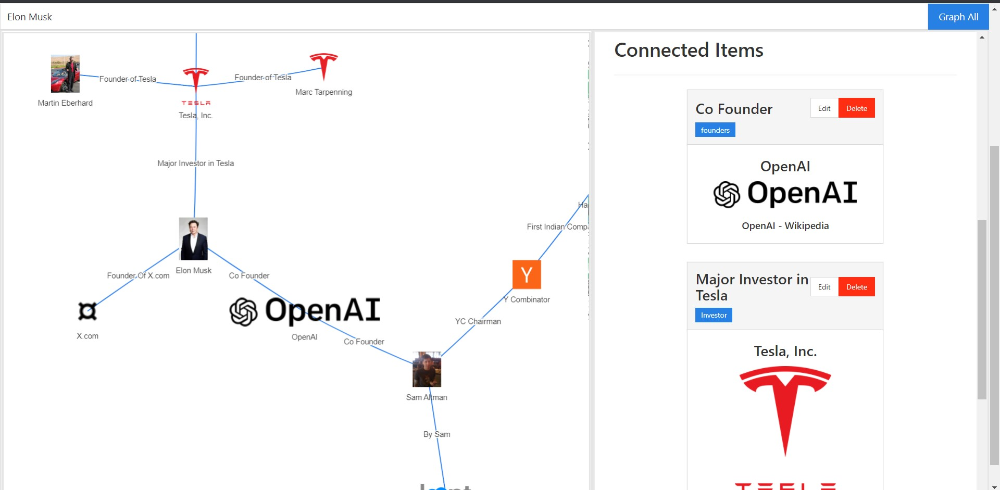
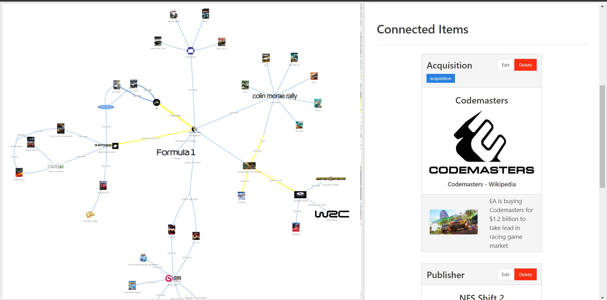

# Graphnote

Store notes in the form of a nodes & connections in a network and visualise them with a force-directed graph.

[Demo Graph](https://graphnote.udbhavs.com/workspace/7/graph?all=true)  

[Large dataset with hundreds of nodes (may take a while to load)](https://graphnote.udbhavs.com/workspace/1/)

## Installation
Use with Node.js v12 (node-sass cannot build with newer versions)
